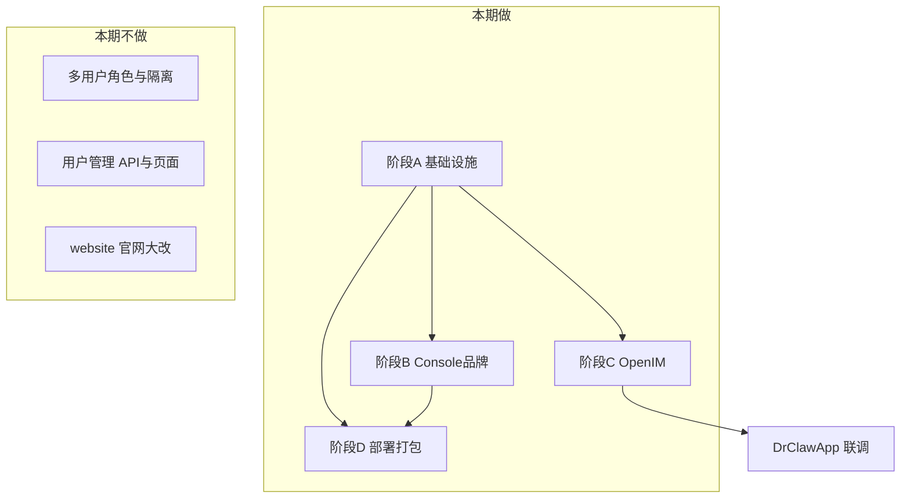
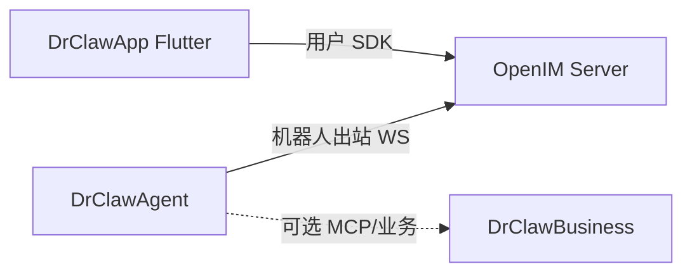
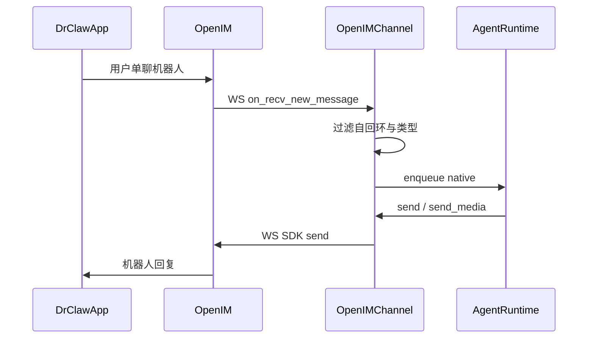

# DrClawAgent 定制化改造方案（详细版）

> **状态**：方案已落地（A/B/C/D 已实施；联调与正式环境安装待验收）  
> **目标仓库**：[DrClawAgent](../)（当前为 QwenPaw 2.0 upstream）  
> **老库参考**：`D:\Workspace\DrClaw`（基线 QwenPaw v1.1.12）  
> **老库文档**：`DRCLAW_SPEC_zh.md` / `DRCLAW_ENV_zh.md` / `DRCLAW_OPENIM_CHANNEL_zh.md`  
> **配套工程**：`DrClawApp`（Flutter + OpenIM）、`DrClawBusiness`（业务中心）

---

## 0. 文档说明

本文是 **实施前的详细改造方案**，回答：改什么、为什么、改哪些文件、怎么验收、明确不做什么。

| 文档 | 用途 |
|------|------|
| 本文 `DRCLAW_CUSTOMIZATION_PLAN_zh.md` | 总方案与分阶段实施说明 |
| 实施后补齐 `DRCLAW_ENV_zh.md` | 环境变量运行时参考 |
| 实施后补齐 `DRCLAW_OPENIM_CHANNEL_zh.md` | OpenIM 频道运维与联调 |

**实施顺序**：阶段 A → B → C → D。C 依赖 A；B 与 C 可并行（视觉不阻塞联调）。

---

## 1. 背景与现状

### 1.1 背景

Dr.Claw 是面向 **医疗私有化** 的个人 AI 助手交付物，在 QwenPaw 之上做品牌、基础设施与业务频道定制，并与 Flutter IM（`DrClawApp`）通过 OpenIM 机器人账号对接。

老库已在 QwenPaw **v1.1.12** 完成一轮定制。新库 `DrClawAgent` 已切到 **QwenPaw 2.0**，代码基本为 upstream 原样，需把老库定制（**不含多用户**）迁移并适配 2.0 架构差异。

### 1.2 新库现状（改造前）

| 检查项 | DrClawAgent（2.0）现状 |
|--------|------------------------|
| 产品名 / `PROJECT_NAME` | `QwenPaw` |
| 主色 / 默认语言 | `#FF7F16` / `en` |
| 工作目录 | 默认 `~/.qwenpaw`（兼容 `~/.copaw`） |
| 环境变量 | 仅 `QWENPAW_*` → `COPAW_*`；无 `env_resolve.py` |
| CLI | 仅 `qwenpaw` / `copaw` |
| OpenIM Channel | **不存在** |
| 遥测 | `telemetry.py` 仍采集上传 |
| MCP 超时 | connect 默认 30s，SSE/读默认 300s |
| Docker / 桌面 | QwenPaw 品牌与 `QWENPAW_*` |
| Console Header | 仍有 GitHub / Resources 等社区外链 |
| Auth | upstream 单用户；`QWENPAW_AUTH_ENABLED` 默认关 |

### 1.3 老库已完成、需迁移的能力（摘要）

1. **品牌与私有化 Console**（蓝主题、中文、医疗登录页、去社区外链、离线图标）
2. ~~多用户认证与权限隔离~~ → **本期不做**
3. **基础设施**（`~/.drclaw`、`drclaw` CLI、`DRCLAW_*`、遥测禁用、MCP 600s、备份/Docker 品牌）
4. **OpenIM 内置频道**（出站 WS，对接 App 机器人单聊）

---

## 2. 目标、原则与范围

### 2.1 产品目标

交付可私有化部署的 **Dr.Claw Agent**：

- 对外品牌为 Dr.Claw，数据默认落在本机 `~/.drclaw`
- Console 适合内网交付（无强制社区外链、断网可配置模型/频道）
- 与 `DrClawApp` 通过 OpenIM 机器人互通（文本 / 图片 / 文件）
- 继续兼容 upstream 插件、Skill、`import qwenpaw`

### 2.2 兼容原则（硬约束）

| 决策 | 说明 |
|------|------|
| Python 包名 / import 不变 | 仍为 `qwenpaw`，避免破坏 pip、插件、Skill metadata |
| 插件协议不变 | 保留 `window.QwenPaw.*` 等兼容面 |
| CLI 只增加别名 | 新增 `drclaw`，与 `qwenpaw` / `copaw` 同入口 |
| 环境变量三前缀 | 运行时读写以 `DRCLAW_*` 为准；`QWENPAW_*` / `COPAW_*` 只读兼容 |
| 工作目录升级兼容 | 已有 `~/.qwenpaw` / `~/.copaw` 则沿用，新装默认 `~/.drclaw` |
| 优先复用老库实现 | 按 2.0 路径差异适配，避免重写业务逻辑 |

### 2.3 本期范围



### 2.4 明确不做（原「第 2 点」多用户）

以下能力老库有、**本期一律不迁移**：

- `auth.json` 的 `users[]` / `role` / `allowed_agents` 多用户模型
- `/api/users`、`users_router.py`、Console「用户管理」页
- 后端按角色过滤 Agent、按 `user_id` 过滤会话列表
- Sidebar 普通用户菜单白名单（仅 Chat + Inbox）
- `authApi.verify` 缓存 `role`、按角色分流菜单

**认证策略（本期）**：

- 沿用 upstream **单用户** Auth 实现
- 私有化默认 **`DRCLAW_AUTH_ENABLED=true`**（环境变量前缀迁移后）
- 登录页可用医疗风 UI，但只处理 token（**不写 role**）

多用户若需要，作为独立二期，避免与品牌 / OpenIM 耦合。

---

## 3. 总体架构

### 3.1 工程关系



- App 用户与机器人 **单聊**，消息经 OpenIM 到达 Agent 内置 `openim` Channel
- App **禁止**直连 Agent `/console/chat` SSE 作为主对话路径（主对话走 IM）
- Agent 仍提供 Console 供运维配置模型、频道、技能等

### 3.2 运行时目录

```
{WORKING_DIR}/                 # 默认 ~/.drclaw；兼容已有 ~/.qwenpaw / ~/.copaw
{WORKING_DIR}.secret/          # auth、envs.json 等
{WORKING_DIR}.backups/         # 备份（若启用）
```

OpenIM WS 本地状态建议落在对应 Agent workspace 下（如 `workspace_dir/openim_ws`），避免多实例冲突。

### 3.3 环境变量解析链

```text
DRCLAW_*  >  QWENPAW_*  >  COPAW_*
```

实现：新增 `src/qwenpaw/env_resolve.py`（从老库移植）；`constant.py` 的 `_get_env` / `EnvVarLoader` 统一走该链。写入规范键时使用 `DRCLAW_*`。

---

## 4. 阶段 A：基础设施

### 4.1 目标

本地可执行 `drclaw app`，工作目录 / 环境变量 / CLI / 遥测 / MCP 超时符合 Dr.Claw 约定，为后续品牌与 OpenIM 打底。

### 4.2 改动清单

#### 4.2.1 常量与工作目录

**文件**：[`src/qwenpaw/constant.py`](../src/qwenpaw/constant.py)

| 项 | 改前 | 改后 |
|----|------|------|
| `PROJECT_NAME` | `QwenPaw` | `DrClaw` |
| 默认 `WORKING_DIR` | `~/.qwenpaw` | 无显式 env 时：已有 `~/.copaw` → 已有 `~/.qwenpaw` → **新建 `~/.drclaw`** |
| 环境键名 | `QWENPAW_*` | 对外规范为 `DRCLAW_*`（经 `env_resolve` 兼容旧名） |
| `AUTH_ENABLED` 默认 | 关（空） | 私有化默认 **开**（`true`）；仍为单用户 |

工作目录优先级（建议实现）：

1. `DRCLAW_WORKING_DIR` / `QWENPAW_WORKING_DIR` / `COPAW_WORKING_DIR`（显式）
2. 已存在的 `~/.copaw`
3. 已存在的 `~/.qwenpaw`
4. 默认 `~/.drclaw`

#### 4.2.2 环境变量模块

**新增**：`src/qwenpaw/env_resolve.py`（从老库 `D:\Workspace\DrClaw\src\qwenpaw\env_resolve.py` 移植）

提供：

- `get_env` / `set_env` / `pop_env` / `drclaw_env` / `env_suffix`
- 与 `EnvVarLoader`、Docker `entrypoint.sh` 行为一致

**单测**：移植或新增 `tests/unit/utils/test_env_resolve.py`。

#### 4.2.3 CLI 入口

**文件**：[`pyproject.toml`](../pyproject.toml)

```toml
[project.scripts]
qwenpaw = "qwenpaw.cli.main:cli"
copaw = "qwenpaw.cli.main:cli"
drclaw = "qwenpaw.cli.main:cli"
```

CLI 文案中面向用户的产品名改为 Dr.Claw（如 `init` 安全提示）；内部模块路径仍为 `qwenpaw`。

#### 4.2.4 遥测禁用

**文件**：[`src/qwenpaw/utils/telemetry.py`](../src/qwenpaw/utils/telemetry.py)

改为空实现：不采集、不上传；保留同名 API，避免调用方报错。

#### 4.2.5 MCP 超时（2.0 路径差异）

老库：`src/qwenpaw/app/mcp/constants.py`  
新库：**无该文件**；超时在：

- [`src/qwenpaw/drivers/handlers/mcp_stateful_client.py`](../src/qwenpaw/drivers/handlers/mcp_stateful_client.py)

| 参数 | 改前默认 | 改后默认 |
|------|----------|----------|
| connect / 重连 | 30s | **600s** |
| SSE / 读 / 工具执行 | 300s（`60*5`） | **600s** |

支持环境变量覆盖（名称与老库对齐，经 `DRCLAW_MCP_*`）：

- `DRCLAW_MCP_CONNECT_TIMEOUT_SECONDS`
- `DRCLAW_MCP_READ_TIMEOUT_SECONDS`
- `DRCLAW_MCP_CLOSE_TIMEOUT_SECONDS`
- `DRCLAW_MCP_OAUTH_HTTP_TIMEOUT_SECONDS`（若 2.0 有对应调用点）

建议抽常量模块（如 `src/qwenpaw/app/mcp/constants.py` 或 `drivers/mcp_timeouts.py`），避免魔法数散落。

#### 4.2.6 备份与恢复锁品牌

**目录**：`src/qwenpaw/backup/_utils/`

| 项 | 改前 | 改后 |
|----|------|------|
| 备份 ID 前缀 | `qwenpaw-{ver}-…` | `drclaw-{ver}-…`（旧前缀仍可导入） |
| 恢复锁文件 | `.qwenpaw_restore.lock` | `.drclaw_restore.lock`（启动迁移旧锁） |
| 锁超时 env | `QWENPAW_RESTORE_LOCK_TIMEOUT_SECONDS` | `DRCLAW_RESTORE_LOCK_TIMEOUT_SECONDS`（兼容旧名） |

#### 4.2.7 日志路径脱敏

**新增**：`src/qwenpaw/utils/log_sanitize.py`（从老库移植）  
调试日志去掉 `src/qwenpaw/` / `src/drclaw/` 等源码路径前缀，降低内网日志噪声。

#### 4.2.8 文档处理依赖（可选但建议与 Docker 对齐）

老库曾增加：`pypdf`、`pdfplumber`、`python-docx`、`pytesseract` 等。  
本期：对照老库 `pyproject.toml` 与 `deploy/Dockerfile` apt 包，按需迁入，保证文档 Skill 在容器内可用。非阻塞项，可与阶段 D 一起合入。

#### 4.2.9 阶段 A 交付文档

新增 [`docs/DRCLAW_ENV_zh.md`](./DRCLAW_ENV_zh.md)：从老库裁剪，**删除多用户相关段落**，保留路径 / 运行 / Auth（单用户）/ MCP / Docker 示例。

### 4.3 阶段 A 验收

- [ ] `pip install -e .` 后 `drclaw --help` / `drclaw app` 可用
- [ ] 新环境无旧目录时，数据写入 `~/.drclaw`
- [ ] 设置 `QWENPAW_WORKING_DIR` 仍可生效（兼容）
- [ ] 设置 `DRCLAW_AUTH_ENABLED` / 旧名均可控制 Auth
- [ ] 遥测无外网上报
- [ ] MCP 客户端默认超时为 600s（或可通过 env 验证）
- [ ] `docs/DRCLAW_ENV_zh.md` 已提交

---

## 5. 阶段 B：Console 品牌与私有化 UI

### 5.1 目标

Console 观感与文案符合医疗私有化交付；去掉社区外链；断网可配置 Provider/Channel。

### 5.2 主题与基础体验

| 项 | 改前 | 改后 | 主要位置 |
|----|------|------|----------|
| 主色 | `#FF7F16` | `#2657C9` | `console/src/App.tsx`、layout less |
| 页面背景 | `#f9f8f4` | `#F7F8FA` | 样式文件 |
| 默认语言 | `en` | `zh` | `i18n.ts`、antd/dayjs locale |
| 浏览器标题 | QwenPaw Console | Dr.Claw Console | `index.html` |
| favicon | upstream | 本地 `/favicon.svg` | `console/public/` |

资源：从老库拷贝 `console/public` 品牌图（`logo-*.png`、`login*.png`、`avatar.png`、`favicon.svg`、文件类型 icons 等）。

### 5.3 登录页

| 项 | 说明 |
|----|------|
| 默认组件 | 新增并启用 `console/src/pages/Login/drclaw/`（医疗风） |
| upstream 页 | `pages/Login/index.tsx` **保留**，运行时不走 |
| Auth 存储 | `drclaw_auth_token`（及如需的 username）；**不存 role** |
| 401 | 清理 Dr.Claw 前缀的 auth 键 |

### 5.4 Header 与外链

**文件**：`console/src/layouts/Header.tsx`

| 改前 | 改后 |
|------|------|
| Logo svg、Resources、GitHub、版本更新检测 | Logo PNG；静态版本号；无上述外链/更新弹窗 |
| 引用 `constants.ts` 外链 | Header **不再引用**（`constants.ts` 可保留不动） |
| Coding / 语言 / 主题 | **保留** |

帮助按钮：`ChannelDrawer` / `ACPDrawer` 等文档入口用 **CSS `display: none`** 隐藏，JSX 与 URL 保留便于与 upstream diff。

### 5.5 离线图标

- Provider / Channel 图标改为本地 `console/src/assets/providers/*.png`、`channels/*.png`
- 移植 `hooks/useOfflineFileIcons.ts`，在 `main.tsx` 引入
- `providerIcon.ts` 等改为本地 import

### 5.6 文案（locales）

- 产品名 QwenPaw → Dr.Claw
- 路径提示 `~/.qwenpaw` → `~/.drclaw`
- 医疗场景免责声明（`zh.json` 等）
- **不改**：pip 包名文案中的 `qwenpaw[…]`、Skill metadata 键 `"qwenpaw"`（若界面展示包名，按「安装包名仍为 qwenpaw」保留）

### 5.7 明确不做（前端）

- `pages/Settings/Users/**`
- Sidebar 按角色过滤菜单
- `sessionApi` 带 `user_id`
- `allowed_agents` / Agent 列表前端隔离
- `authApi.verify` 的 role 逻辑

### 5.8 可选增强（不阻塞主路径）

老库曾做「聊天助手身份按当前 Agent 动态切换」（头像/昵称）。与权限无关，可在阶段 B 末尾或后续迭代：

- `chatAgentIdentity.ts` / `useChatAgentIdentity.ts` / 首字母头像组件等  
若工期紧，可标为 B+，不挡验收。

### 5.9 阶段 B 验收

- [ ] 首屏主色为医疗蓝，默认中文
- [ ] 登录页为 Dr.Claw 医疗风；登录后仅 token 体系工作
- [ ] Header 无 GitHub / Resources / 更新提示
- [ ] 断网下 Models / Channels 图标可显示
- [ ] 无「用户管理」菜单与路由
- [ ] 文案与路径提示为 `~/.drclaw`

---

## 6. 阶段 C：OpenIM Channel

### 6.1 目标

内置 `openim` 频道：DrClaw → OpenIM 出站长连接收发；医生在 Flutter 私聊机器人即可对话。无需公网回调。

### 6.2 架构与数据流



**网络前置**：

| 方向 | 要求 |
|------|------|
| DrClaw → OpenIM API | 可达 `api_url`（如 `:10002`） |
| DrClaw → OpenIM WS | 可达 `ws_url`（默认可由 API 主机推导 `:10001`） |
| Flutter → OpenIM | App 既有配置 |
| OpenIM → DrClaw | **不需要** |

### 6.3 能力范围

| 本期做 | 本期不做 |
|--------|----------|
| 单聊文本 / 图片 / 文件收发 | 流式打字机 |
| 语音可入站 | 语音原生出站（需 duration） |
| 断线重连、消息去重 | 视频消息、群聊 @ |
| Console 三项凭证配置 | 自动创建机器人账号 |
| | Flutter 直连 Console SSE |

### 6.4 配置模型

在 [`src/qwenpaw/config/config.py`](../src/qwenpaw/config/config.py) 增加 `OpenIMConfig`，并挂到 `ChannelConfig.openim`。

| 字段 | 必填 | 说明 |
|------|------|------|
| `enabled` | | 默认 `false` |
| `api_url` | 是 | OpenIM API 根 |
| `app_id` | 是 | 机器人 userID |
| `app_secret` | 是 | `share.yaml` secret |
| `ws_url` | | 空则由 `api_url` 推导 |
| `admin_user_id` | | 默认 `imAdmin` |
| `platform_id` | | 默认 `7`（Linux） |
| 基类字段 | | `bot_prefix`、ACL 等 |

环境变量（`from_env`）：`OPENIM_CHANNEL_ENABLED`、`OPENIM_API_URL`、`OPENIM_APP_ID`、`OPENIM_APP_SECRET`、`OPENIM_WS_URL` 等（与老库一致，**不必**强行改成 `DRCLAW_OPENIM_*`，与其它频道 `FEISHU_*` 风格一致）。

`agent.json` 示例：

```json
{
  "channels": {
    "openim": {
      "enabled": true,
      "api_url": "http://127.0.0.1:10002",
      "app_id": "drclaw_bot",
      "app_secret": "your_share_yaml_secret"
    }
  }
}
```

### 6.5 代码移植与 2.0 注册点

**老库源码**（直接移植并适配）：

```text
D:\Workspace\DrClaw\src\qwenpaw\app\channels\openim\
  __init__.py
  constants.py
  client.py      # REST：admin / user token
  ws_client.py   # WS login / start / stop / send
  channel.py     # OpenIMChannel
```

**2.0 必须改动的注册点**（相对 1.x 更明确）：

| 位置 | 动作 |
|------|------|
| `src/qwenpaw/app/channels/registry.py` | `_BUILTIN_SPECS` 增加 `"openim": (".openim", "OpenIMChannel")` |
| `src/qwenpaw/app/channels/schema.py` | `BUILTIN_CHANNEL_TYPES` 增加 `"openim"` |
| `src/qwenpaw/config/config.py` | `OpenIMConfig` + `ChannelConfig.openim` |
| Console `ChannelDrawer.tsx` / `constants` | 表单三项 + 说明文案 |
| `pyproject.toml` | 依赖 `openim-sdk-core` |
| `cli/doctor_checks.py`（若有） | 凭证完整性 + SDK 可导入检查 |
| `scripts/probe_openim_ws.py` | 联调探针（从老库拷贝） |
| `tests/unit/channels/test_openim_channel.py` | 单测（从老库适配） |

适配注意：

- `BaseChannel` / `from_config` 签名以 2.0 为准，对照 `feishu/channel.py`
- `workspace_dir` 传入方式按 `ChannelManager.from_config` 现有约定
- 发消息仅 WS SDK，无 REST 降级（与老库方案一致）

### 6.6 Console 表单

- 顶部说明：长连接收消息，无需公网回调
- 仅展示：`API URL` / `App ID` / `App Secret`
- `ws_url` / `platform_id` / `admin_user_id` 不进 UI，靠默认或手改 `agent.json`

### 6.7 安全与运维要点

- `app_secret`、机器人 token 仅服务端；Flutter 不持有机器人凭据
- 机器人账号 **仅 DrClaw 一端在线**（勿在 App 再登同一 `app_id`）
- ACL：`dm_policy` / `allow_from` 与其它 Channel 相同
- 回滚：`channels.openim.enabled=false`，不影响人–人 IM

### 6.8 阶段 C 文档与验收

交付：[`docs/DRCLAW_OPENIM_CHANNEL_zh.md`](./DRCLAW_OPENIM_CHANNEL_zh.md)（可基于老库文档修订路径）。

验收：

- [ ] Console 可启用 openim 并保存三项凭证
- [ ] 启动后日志出现 WS connected / login ok
- [ ] Flutter 用户加机器人好友，文本往返成功
- [ ] 图片 / 文件入站与出站验证通过
- [ ] 断网恢复后自动重连仍可聊
- [ ] 单测与 `probe_openim_ws.py` 可用
- [ ] **无**多用户相关改动混入本阶段

---

## 7. 阶段 D：部署与打包品牌化

### 7.1 目标

Docker / Compose / CI / 桌面安装包对外统一为 Dr.Claw，环境变量与入口使用 `DRCLAW_*` / `drclaw`。

### 7.2 Docker 与 Compose

| 文件 | 要点 |
|------|------|
| `deploy/Dockerfile` | ENV 改 `DRCLAW_*`；工作目录 `/app/working`；端口 `8088`；按需装 LibreOffice/Tesseract |
| `deploy/entrypoint.sh` | `DRCLAW_*` 优先，Shell 层兼容 QWENPAW/COPAW；`drclaw init` |
| `deploy/config/supervisord.conf.template` | `drclaw app --port ${DRCLAW_PORT}` |
| `docker-compose.yml` | 服务名 `drclaw`；镜像名含 `drclaw`；卷 `./drclaw-data`；Auth 相关用 `DRCLAW_AUTH_*` |
| `scripts/docker_build.sh` | `DRCLAW_DISABLED_CHANNELS` 等 |

### 7.3 CI

| 项 | 建议 |
|----|------|
| Docker 发布 | GHCR `ghcr.io/{owner}/drclaw`（或组织约定名） |
| upstream 社区 Bot / 官网自动发布等 | 改为仅 `workflow_dispatch`，避免误发 upstream 渠道 |
| 测试触发分支 | 按本仓库约定保留 `main`/`develop` |

具体 owner/镜像名以团队仓库为准，实施时写死一处常量并在 `DRCLAW_ENV_zh.md` 示例中同步。

### 7.4 桌面端（Tauri / NSIS）

| 项 | 改后 |
|----|------|
| 产品名 | Dr.Claw Desktop |
| identifier | `io.drclaw.desktop` |
| 环境注入 | `DRCLAW_DESKTOP_APP`、`DRCLAW_DESKTOP_PY_RUNTIME`、`DRCLAW_BACKEND_READY` |
| 默认端口 / 绑定 | 与老库对齐：端口 **8088**，`DRCLAW_DESKTOP_API_HOST` 默认 `0.0.0.0`（若需仅本机可改 `127.0.0.1`） |
| 打包图标 / NSIS 产出名 | Dr.Claw / `DrClaw-Setup-*.exe` |

**刻意保留**：NSIS 编译期 `QWENPAW_VERSION` 等非运行时常量（与老库一致即可）。

### 7.5 阶段 D 验收

- [ ] `docker compose up` 后服务以 Dr.Claw 环境变量启动
- [ ] 容器内工作目录与 secret 路径符合文档
- [ ] 桌面标识与窗口标题为 Dr.Claw（若本期打桌面包）
- [ ] CI 不向 upstream 社区渠道误发布

---

## 8. 2.0 路径对照（实施速查）

| 主题 | 老库（1.x） | 新库（2.0） |
|------|------------|------------|
| 常量 / 工作目录 | `src/qwenpaw/constant.py` | 同路径 |
| env 解析 | `env_resolve.py`（老库新增） | **需新增**；现逻辑在 `constant._get_env` |
| CLI scripts | `pyproject.toml` | 同；补 `drclaw` |
| Channel 实现 | `app/channels/openim/` | 同目录结构；经 `registry.py` 注册 |
| Channel 配置 | `config/config.py` | 同 |
| MCP 超时 | `app/mcp/constants.py` | **`drivers/handlers/mcp_stateful_client.py`** |
| Telemetry | `utils/telemetry.py` | 同路径 |
| Auth | `app/auth.py` | 同；保持单用户，仅改默认与 env 前缀 |
| Console Header | `console/src/layouts/Header.tsx` | 同 |
| 主题 | `console/src/App.tsx` | 同 |
| Docker | `deploy/*` | 同目录 |

---

## 9. 新增 / 重点修改文件总表

### 9.1 新增（预期）

```text
src/qwenpaw/env_resolve.py
src/qwenpaw/utils/log_sanitize.py
src/qwenpaw/app/channels/openim/**          # 从老库移植
console/src/pages/Login/drclaw/**
console/src/hooks/useOfflineFileIcons.ts
console/src/assets/providers/*.png
console/src/assets/channels/*.png
console/public/logo-*.png, login*.png, avatar.png, favicon.svg, icons/*
scripts/probe_openim_ws.py
tests/unit/utils/test_env_resolve.py
tests/unit/channels/test_openim_channel.py
docs/DRCLAW_ENV_zh.md
docs/DRCLAW_OPENIM_CHANNEL_zh.md
docs/DRCLAW_CUSTOMIZATION_PLAN_zh.md        # 本文
```

### 9.2 重点修改（预期）

```text
pyproject.toml
src/qwenpaw/constant.py
src/qwenpaw/utils/telemetry.py
src/qwenpaw/drivers/handlers/mcp_stateful_client.py
src/qwenpaw/backup/_utils/*
src/qwenpaw/app/channels/registry.py
src/qwenpaw/app/channels/schema.py
src/qwenpaw/config/config.py
src/qwenpaw/app/auth.py                      # 仅 env 前缀与默认开启
console/src/App.tsx
console/src/i18n.ts
console/src/layouts/Header.tsx
console/src/locales/*.json
console/src/pages/Control/Channels/...
deploy/Dockerfile
deploy/entrypoint.sh
docker-compose.yml
console/src-tauri/tauri.conf.json
相关 CI workflow
```

### 9.3 刻意不改

| 项 | 原因 |
|----|------|
| `website/**` 大改 | 非本期交付重点 |
| `import qwenpaw` / pip 名 | 生态兼容 |
| `window.QwenPaw.*` | 插件兼容 |
| Skill metadata `"qwenpaw"` | 生态兼容 |
| Ant Design `prefixCls: qwenpaw` | 减少无意义样式 diff |
| 多用户相关全部文件 | 本期排除 |

---

## 10. 风险与应对

| 风险 | 影响 | 应对 |
|------|------|------|
| 2.0 Channel/BaseChannel API 与 1.x 差异 | OpenIM 移植编译失败 | 以 `feishu` 频道为模板逐项对齐；单测先绿再联调 |
| MCP 超时散落多处 | 改不全 | 集中常量 + 全文检索 `timeout=30` / `60 * 5` |
| 环境变量漏改 | 运行时读不到配置 | `env_resolve` 单测 + Docker entrypoint 三前缀兼容 |
| 默认开启 Auth | 本地开发需登录 | 文档写明；开发可用 `DRCLAW_AUTH_ENABLED=false` |
| 机器人多端登录 | 收不到消息 | 文档强调 App 勿登录同一 `app_id` |
| 与 upstream 后续 rebase | 冲突 | 品牌/私有化尽量集中改文件；隐藏外链用 CSS 而非删 JSX |

---

## 11. 实施计划建议

| 阶段 | 内容 | 依赖 | 建议产出 |
|------|------|------|----------|
| A | 基础设施 + ENV 文档 | 无 | 可 `drclaw app` |
| B | Console 品牌私有化 | A（auth 键前缀） | 可演示交付 UI |
| C | OpenIM + 联调文档 | A；与 B 可并行 | App 可对话 |
| D | Docker / CI / 桌面 | A；B 资源可复用 | 可发布镜像/安装包 |

每阶段合并前完成对应验收清单。不在同一 PR 混入多用户改动。

---

## 12. 总验收（全部阶段完成后）

1. `drclaw app` 启动，数据在 `~/.drclaw`（或兼容旧目录）
2. Console：蓝主题、中文、医疗登录、无社区外链、无用户管理
3. Auth：单用户；默认启用；`DRCLAW_*` / 旧前缀兼容
4. 无遥测外发；MCP 默认超时 600s
5. OpenIM 启用后，Flutter 私聊机器人文本/图片/文件互通
6. Docker / `DRCLAW_*` 可按 `DRCLAW_ENV_zh.md` 启动
7. 代码与文档中无本期多用户角色隔离行为

---

## 13. 参考资料

- 老库规格：`D:\Workspace\DrClaw\docs\DRCLAW_SPEC_zh.md`
- 老库环境变量：`D:\Workspace\DrClaw\docs\DRCLAW_ENV_zh.md`
- 老库 OpenIM：`D:\Workspace\DrClaw\docs\DRCLAW_OPENIM_CHANNEL_zh.md`
- 老库 OpenIM 实现：`D:\Workspace\DrClaw\src\qwenpaw\app\channels\openim\`
- 上游 QwenPaw：https://github.com/agentscope-ai/QwenPaw
- OpenIM 管理员 token：https://docs.openim.io/zh-Hans/restapi/apis/authenticationManagement/getAdminToken
- PyPI `openim-sdk-core`：https://pypi.org/project/openim-sdk-core/
